# 数据库学习

> SQL (Structured Query Language, SQL)：结构化查询语言
>
> DBMS (Database management system)：数据库管理系统

[TOC]


## 1.数据库的基本概念和发展


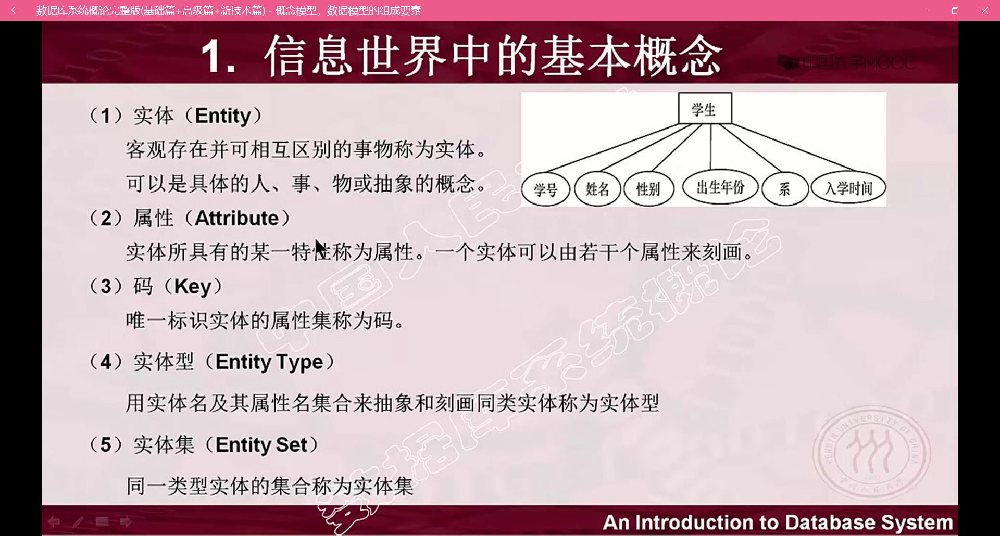

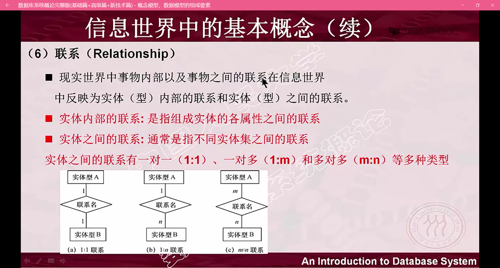

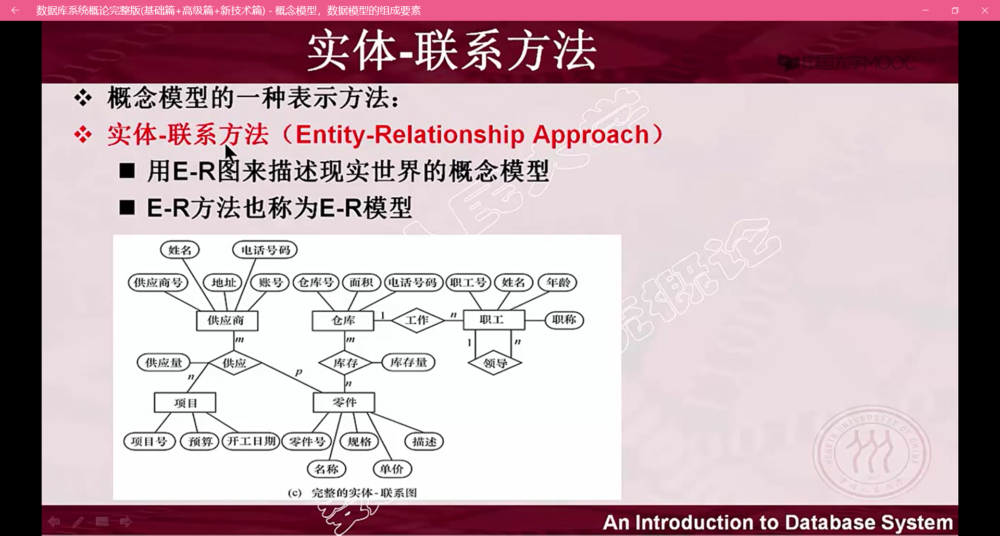


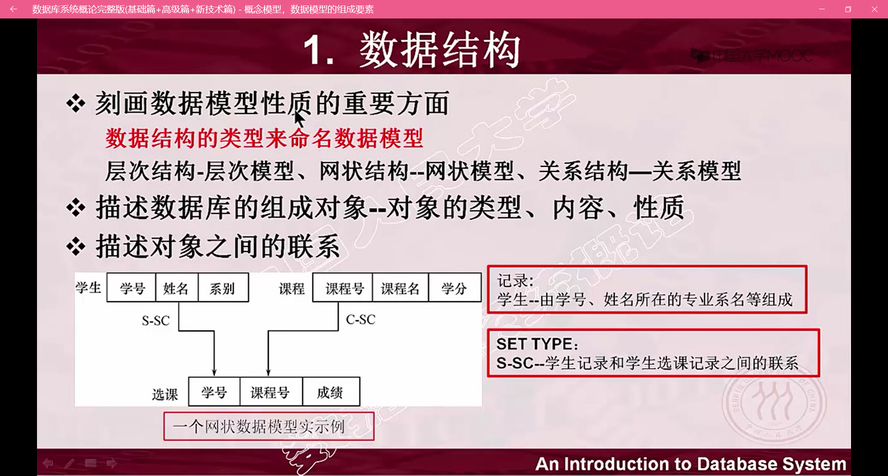


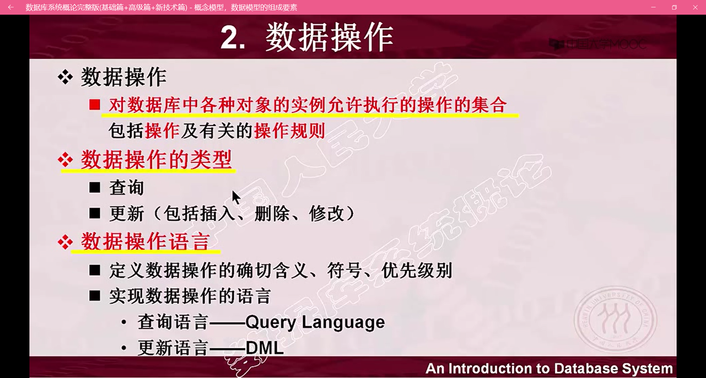


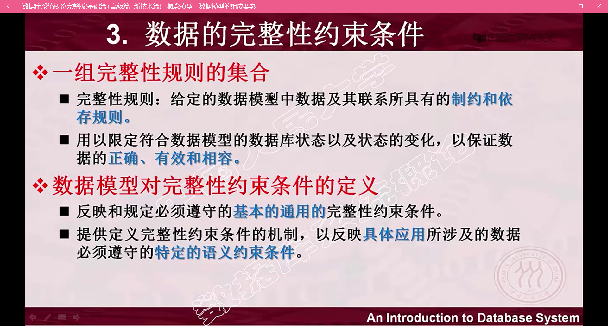


# SQL

## 1.1 SQL概述


## 1.2 数据库创建

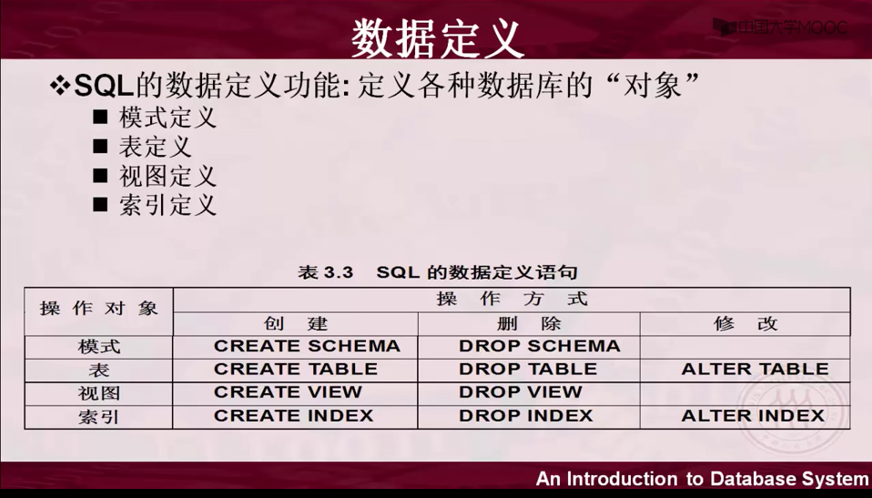

定义模式

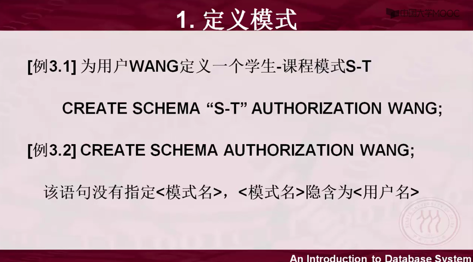

删除模式

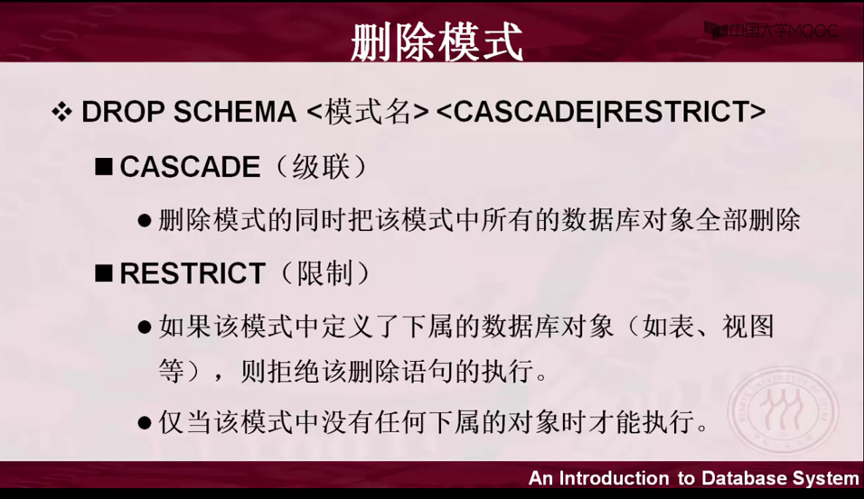

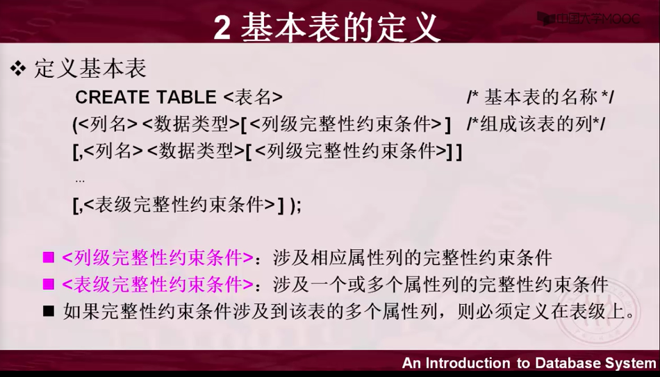


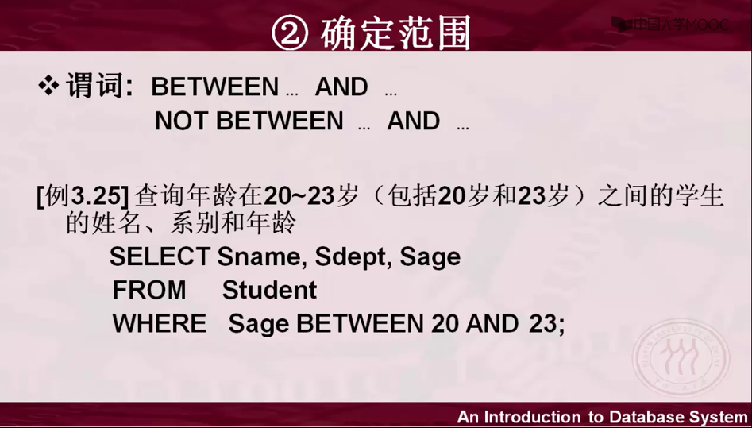


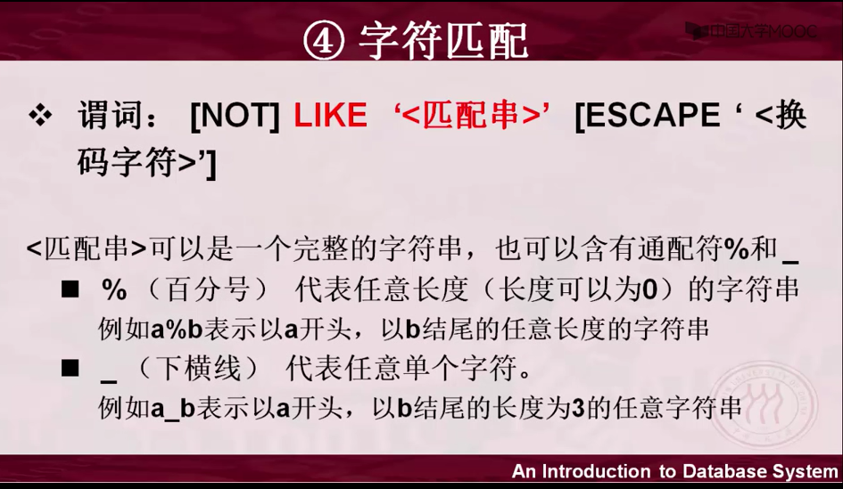


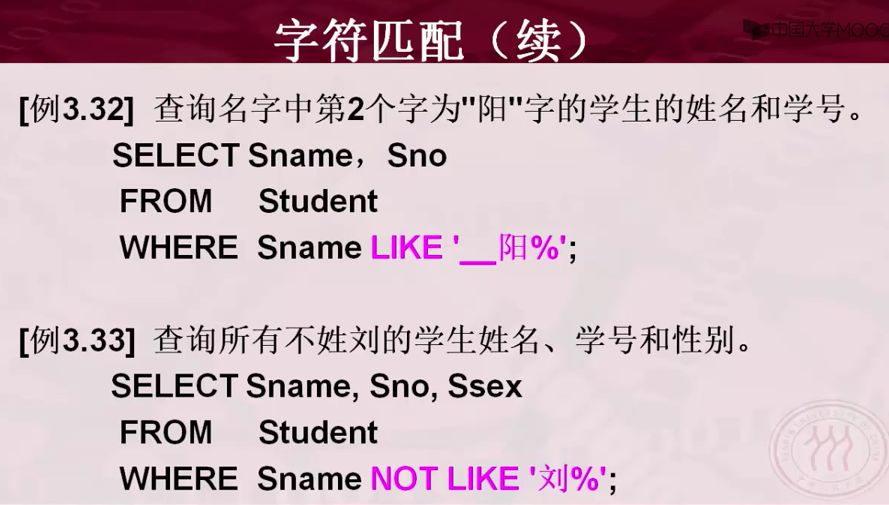


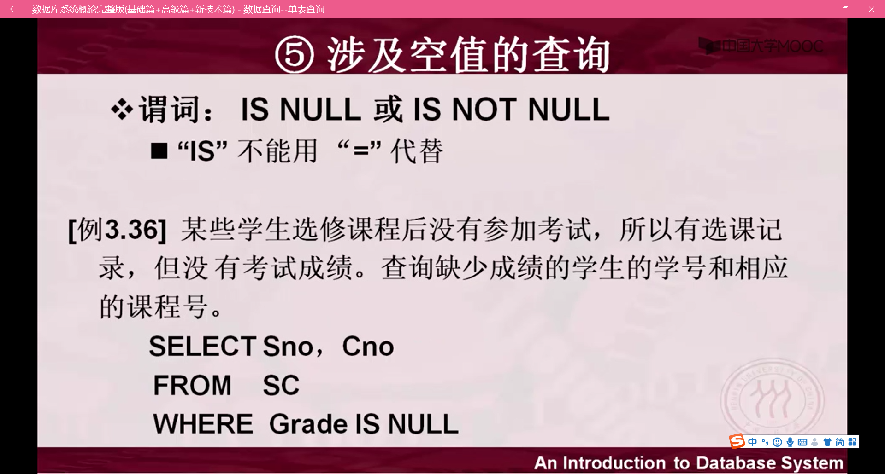


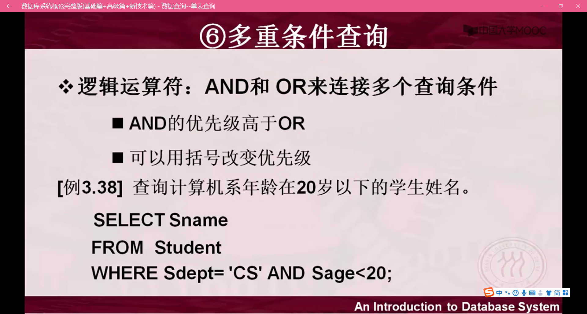


## 1.3 SQL语言

> 分为DDL、DML和DCL

1. **DML(data manipulation language)数据操纵语言**

   就是我们最经常用到的 SELECT、UPDATE、INSERT、DELETE。 主要用来对数据库的数据进行一些操作。

2. **DDL(data definition language)数据库定义语言**

   其实就是我们在创建表的时候用到的一些sql，比如说：CREATE、ALTER、DROP等。DDL主要是用在定义或改变表的结构，数据类型，表之间的链接和约束等初始化工作上。

3. **DCL(Data Control Language)数据控制语言**

   用来授予或回收访问数据库的某种特权,并控制数据库操纵事务发生的时间及效果,对数据库实行监视等。

   COMMIT、SAVEPOINT、ROLLBACK、SET TRANSACTION


## DELETE、DROP和truncate的对比

> 三者都有删除表的作用，区别在于：
>
> - delete和truncate仅仅删除表中的数据，而drop连表结构和数据一同删除。
> - delete是DML（数据操控语言）语句，操作完以后如果不想提交事务还可以回滚，而truncate和drop式DDL(数据定义语言)

# MySQL

> 安装目录：D:\MySQL\mysql-8.0.21-winx64\

[MYSQL网课学习笔记](D:/MySQL/MYSQL使用笔记.md)

[MYSQL安装笔记](D:/MYSQL/MYSQL安装笔记.md)


## MYSQL必知必会学习笔记

1.ORDER BY和LIMIT子句组合，可以用于找出一个列中最高或最低的值；

如下：

```mssql
SELECT prod_price FROM products ORDER BY prod_price DESC LIMIT 1;
```


### MYSQL ALTER命令

> 添加删除或修改表的字段

修改存储引擎：修改为myisam 

```mysql
alter table tableName engine=myisam;
```

删除外键约束

```mysql
alter table tableName drop foreign key keyName;
```

修改字段的相对位置：这里name1为想要修改的字段，type1为该字段原来类型，first和after二选一，这应该显而易见，first放在第一位，after放在name2字段后面 

```mysql
alter table tableName modify name1 type1 first|after name2;
```


### MYSQL索引

> 参考:[菜鸟教程-索引](https://www.runoob.com/mysql/mysql-index.html)
>
> MYSQL建立索引可以大大提高检索速度。
>
> 创建索引时，你需要确保该索引是应用在 SQL 查询语句的条件(一般作为 WHERE 子句的条件)。
>
> 实际上，索引也是一张表，该表保存了主键与索引字段，并指向实体表的记录。
>
> 索引的缺点：虽然索引大大提高了查询速度，同时却会降低更新表的速度，如对表进行INSERT、UPDATE和DELETE。因为更新表时，MySQL不仅要保存数据，还要保存一下索引文件。 

1.普通索引

创建索引

```mysql
CREATE INDEX indexName ON table_name (column_name)
```

修改表结构（添加索引）

```mysql
ALTER table tableName ADD INDEX indexName(columnName)
```

删除索引

```mysql
DROP INDEX [indexName] ON mytable; 
```

2.使用ALTER命令添加和删除索引

- **ALTER TABLE tbl_name ADD PRIMARY KEY (column_list)**：该语句添加一个主键，这意味着索引值必须是唯一的，且不能为NULL。
- **ALTER TABLE tbl_name ADD UNIQUE index_name (column_list):** 这条语句创建索引的值必须是唯一的（除了NULL外，NULL可能会出现多次）。
- **ALTER TABLE tbl_name ADD INDEX index_name (column_list):** 添加普通索引，索引值可出现多次。
- **ALTER TABLE tbl_name ADD FULLTEXT index_name (column_list):**该语句指定了索引为 FULLTEXT ，用于全文索引。

3.使用 ALTER 命令添加和删除主键

>  主键作用于列上（可以一个列或多个列联合主键），添加主键索引时，你需要确保该主键默认不为空（NOT NULL）。实例如下： 

```mysql
mysql> ALTER TABLE testalter_tbl MODIFY i INT NOT NULL;
mysql> ALTER TABLE testalter_tbl ADD PRIMARY KEY (i);
```

 你也可以使用 ALTER 命令删除主键： 

```mysql
mysql> ALTER TABLE testalter_tbl DROP PRIMARY KEY;
```


### 7.数据过滤

where子句的计算次序：`AND`和`OR`操作符的计算次序，AND的计算次序更高。可以使用圆括号将OR中并列的项括起来。

IN操作符后跟由逗号分隔的合法值清单，整个清单必须括在圆括号中  。

### 8.使用通配符进行过滤

1) 百分号%通配符：表示任何字符出现任意次数

通配符可以在搜索模式中的任意位置使用，并且可以使用多个通配符。

<font color=red> 通配符%不能匹配NULL</font>

2) 下划线 _ 通配符：与%一样，但是下划线只能匹配单个字符而不是多个字符。

> 通配符搜索往往比之前提及的其他搜索花费时间更长。
>
> 若非不要，则尽量别在搜索模式的开始出设置通配符，否则将非常耗时。
>
> 

### 9.使用正则表达式进行搜索

> MYSQL仅支持多数正则表达式实现的一个很小的子集。

```mysql
# 使用正则表达式进行匹配，一下将筛选出所有包含文本1000的行
SELECT prod_name FROM products WHERE prod_name REGEXP '1000' ORDER BY prod_name;
# 以下将
SELECT prod_name FROM products WHERE prod_name REGEXP '.000' ORDER BY prod_name;
```


### 10.创建计算字段

> 计算字段：存储在数据库表中的数据一般不是应用程序所需要的格式。我们需要直接从数据库中检索出转换、计算或者格式化过的数据。

**1.拼接字段**

Concat拼接串

```mysql
# 例子
SELECT Concat(vend_name,‘(’,vend_country,‘)’) FROM vendors;
```

> 使用`RTrim()`函数来删除数据右侧多余的空格。
>
> Trim函数用于去除空格，RTrim用于去除右边的空格，LTrim用于去除左边的空格。
>
> Trim则去掉串左右两边的空格。

```mysql
SELECT Concat(RTrim(vend_name),‘(’,RTrim(vend_country),‘)’) FROM vendors;
```

**2.别名 alias**

> 为了方便在客户端中引用拼接的字段。
>
> 别名使用`AS`关键字赋予，有时候也成为导出列(derived column)

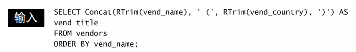

**3.执行算术计算**

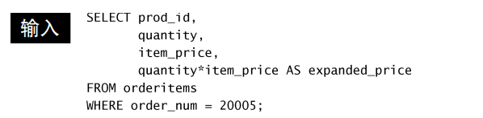


### 11.使用数据处理函数

> 使用函数用于：
>
> 处理文本串、用于在数值数据上进行算术操作、用于处理日期和时间值并从这些值中提取特定成分、返回DBMS正使用的特殊信息

**1.文本处理函数**

Upper()：将文本转换为大写

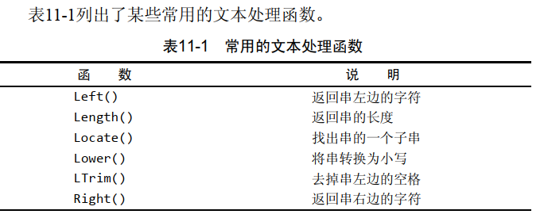

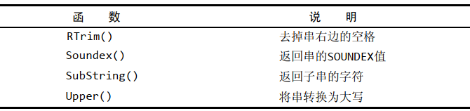

SOUNDEX 是一个将任何文本串转换为描述其语音表示的字母数字模式的算法。SOUNDEX考虑类似的发音字符和音节，使得对串的发音进行比较而不是字母比较。

```mysql
# 例子
SELECT cust_name,cust_contact FROM customers WHERE Soundex(cust_contact)= Soundex('Y Lie');
```

**2.日期和时间处理函数**

> 用于读取、统计和处理 日期和时间的格式。

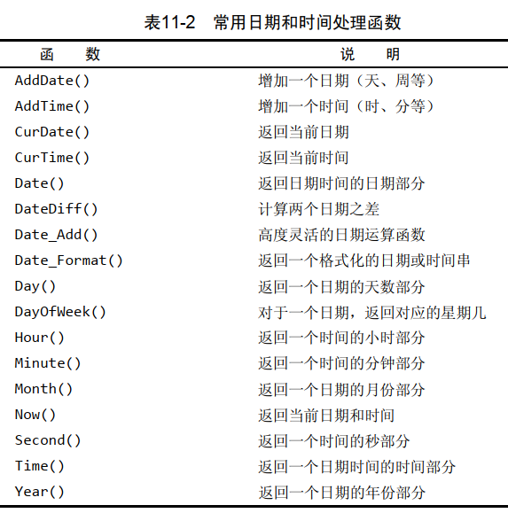

> MYSQL的日期格式为 yyyy-mm-dd

```mysql
# 检索某年某个月的所有记录
SELECT cust_id,order_num FROM orders WHERE Date(order_data) BETWEEN '2005-09-01' AND '2005-09-30';
# 或者
SELECT cust_id,order_num FROM orders WHERE Year(order_data)=2005 AND Month(order_date)=9;
```

**3.数值处理函数**

> 用于处理数值数据、代数、三角或者集合运算。

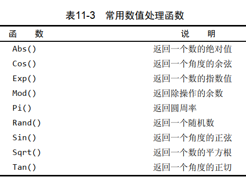


### 12.汇总数据

> 实际想要的是表中的汇总信息而不是某一行的信息。

**1.聚集函数**

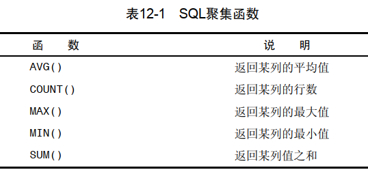

AVG函数 对表中行数技术并计算特定列的和，返回该列的平均值。

```mysql
# 例子：返回
SELECT AVG(prod_price) AS avg_price FROM products;
```

<font color=red>注意：AVG函数只能作用于单列</font>

COUNT()函数进行计数。 可利用COUNT()确定表中行的数目或符合特定条件的行的数目。  

MAX()返回指定列中的最大值。 MAX()要求指定列名。对文本数据使用时，将返回文本在字典顺序下的最后一行。

MIN()的功能正好与MAX()功能相反，它返回指定列的最小值。  

SUM()用来返回指定列值的和。

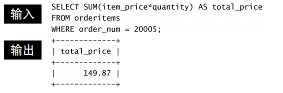

**2.聚集不同值**

> 即添加`DISTINCT`关键字

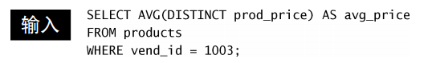

**3.组合聚集函数**

> 根据需要包含多个聚集函数。

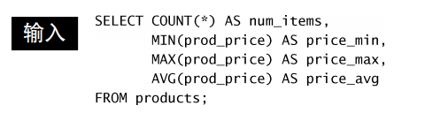


### 13.分组数据

> 包含两个子句：`GROUP BY`和`HAVING`
>
> GROUP  BY子句用于按照某个列的值进行分组，如下：

#### 1.GROUP BY子句

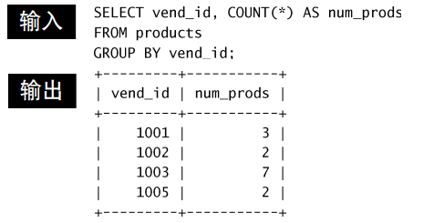

使用GROUP BY的一些规定：

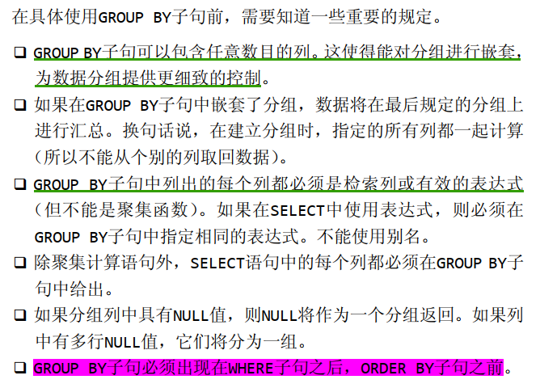

`ROLLUP`，使用WITH ROLLUP关键字，可以得到每个分组以及每个分组汇总级别的值。

#### 2.过滤分组

> GROUP BY 用于分组数据，MYSQL还可以使用HAVING 子句过滤分组。
>
> ==HAVING可以支持所有WHERE操作符。并且WHERE在数据分组前进行过滤，而HAVING在数据分组后进行过滤。被WHERE子句排除的行不包括在分组中。==

```mysql
# 例子：用于过滤cust_id中记录数目大于2的分组
SELECT cust_id,COUNT(*) AS orders FROM orders GROUP BY cust_id HAVING COUNT(*)>2；
```

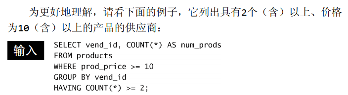

#### 3.分组和排序

>  GROUP BY和 ORDER BY
>
> 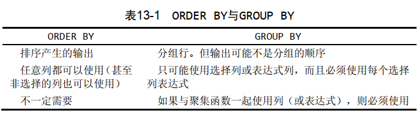
>
> 一般在使用GROUP BY子句时，通常也需要给出ORDER BY子句。
>
> 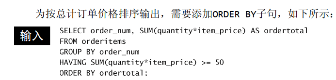

#### 4.SQL查询语句 select

> select共有6个子句，其中select和from式必须的，其他是可选项。必须严格按照如下顺序排列：
>
> 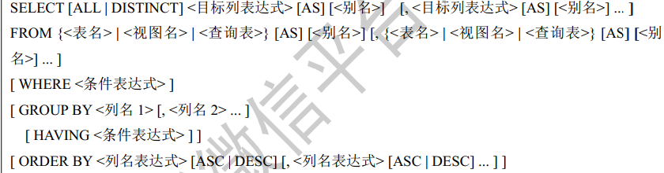
>
> select, from, as , where, group by, having, order by
>
> 默认排序规则是ASC
>
> 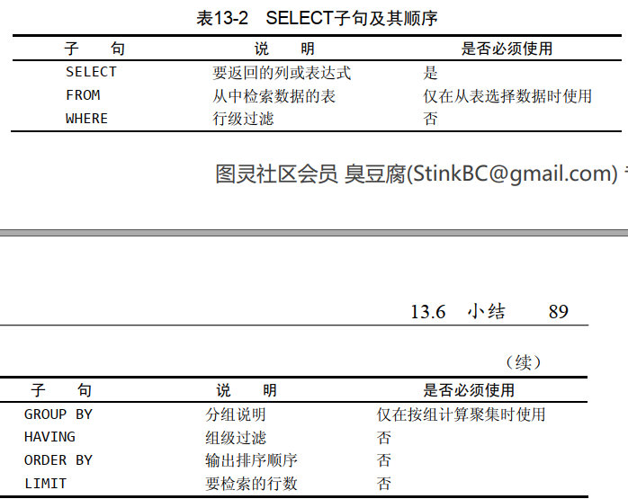

各种子句的意义如下：

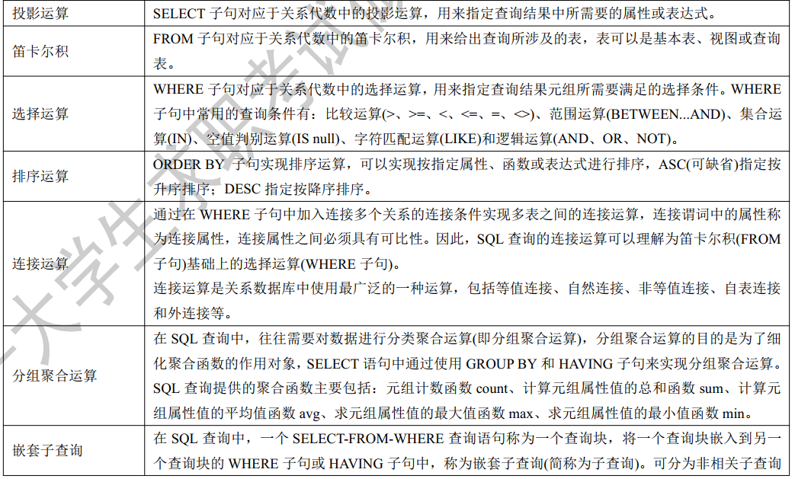


**1）Select子句：** 表示投影运算

**3）where子句：**表示关系代数中的选择运算

where查询条件运算符包括：比较运算（>,>=,<,<=，=，<>）和范围运算（BETWEEN...AND）,集合运算（IN），空值判别运算（IS null）、字符匹配运算（LIKE）和逻辑运算符`与或非`（AND OR NOT）


### 14.使用子查询

2.使用子查询进行过滤

> 在查询中嵌套其他的查询。
>
> 用于把一条SELECT的查询结果用于另一条SELECT语句的WHERE子句。

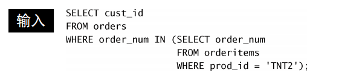

在嵌套的查询汇总，子查询总是由内向外处理。即先处理谓词IN之后的查询。

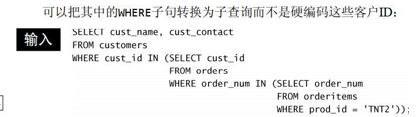


注意格式化嵌套查询语句。

3.作为计算字段使用子查询

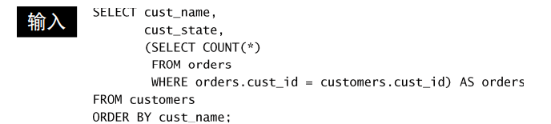


### 15.联结表


## MYSQL事务

> 事务主要用于处理操作两大，复杂度高的数据。在MYSQL中只有使用Innodb数据库引擎才能支持事务操作。
>
> 事务处理可以用来维护数据库的完整性，保证成批的 SQL 语句要么全部执行，要么全部不执行。
>
> 事务用来管理 insert,update,delete 语句

### 事物的ACID特性

一般来说，事务必须满足四个条件(ACID)：

> 原子性（**A**tomicity，或称不可分割性）、一致性（**C**onsistency）、隔离性（**I**solation，又称独立性）、持久性（**D**urability）。 

- **原子性：**一个事务（transaction）中的所有操作，要么全部完成，要么全部不完成，不会结束在中间某个环节。事务在执行过程中发生错误，会被回滚（Rollback）到事务开始前的状态，就像这个事务从来没有执行过一样。
- **一致性：**在事务开始之前和事务结束以后，数据库的完整性没有被破坏。这表示写入的资料必须完全符合所有的预设规则，这包含资料的精确度、串联性以及后续数据库可以自发性地完成预定的工作。
- **隔离性：**数据库允许多个并发事务同时对其数据进行读写和修改的能力，隔离性可以防止多个事务并发执行时由于交叉执行而导致数据的不一致。事务隔离分为不同级别，包括读未提交（Read uncommitted）、读提交（read committed）、可重复读（repeatable read）和串行化（Serializable）。
- **持久性：**事务处理结束后，对数据的修改就是永久的，即便系统故障也不会丢失。

### 事务控制语句

- `BEGIN` 或 `START TRANSACTION` 显式地开启一个事务；
- `COMMIT`也可以使用 COMMIT WORK，不过二者是等价的。COMMIT 会提交事务，并使已对数据库进行的所有修改成为永久性的；
- `ROLLBACK` 也可以使用 `ROLLBACK WORK`，不过二者是等价的。回滚会结束用户的事务，并撤销正在进行的所有未提交的修改；
- `SAVEPOINT identifier`，SAVEPOINT 允许在事务中创建一个保存点，一个事务中可以有多个 SAVEPOINT；
- `RELEASE SAVEPOINT identifier` 删除一个事务的保存点，当没有指定的保存点时，执行该语句会抛出一个异常；
- `ROLLBACK TO identifier` 把事务回滚到标记点；
- `SET TRANSACTION` 用来设置事务的隔离级别。InnoDB 存储引擎提供事务的隔离级别有READ UNCOMMITTED、READ COMMITTED、REPEATABLE READ 和 SERIALIZABLE。


### MYSQL事务处理的两种方法

1、用 BEGIN, ROLLBACK, COMMIT来实现

- **BEGIN** 开始一个事务
- **ROLLBACK** 事务回滚
- **COMMIT** 事务确认

2、直接用 SET 来改变 MySQL 的自动提交模式:

- **SET AUTOCOMMIT=0** 禁止自动提交
- **SET AUTOCOMMIT=1** 开启自动提交


# 数据库基础常考题

## 请你说一说数据库索引？

参考回答：

索引是对数据库表中一列或多列的值进行排序的一种结构，使用索引可快速访问数据库表中的特定信息。

例如：如果想按特定职员的姓来查找他或她，则与在表中搜索所有的行相比，索引有助于更快地获取信息。

索引的一个主要目的就是加快检索表中数据的方法，亦即能协助信息搜索者尽快的找到符合限制条件的记录ID的辅助数据结构。


## 请你说说索引是什么，多加索引一定会好吗？

1、索引

数据库索引是为了增加查询速度而对表字段附加的一种标识，是对数据库表中一列或多列的值进行排序的一种结构。

DB在执行一条Sql语句的时候，默认的方式是根据搜索条件进行全表扫描，遇到匹配条件的就加入搜索结果集合。如果我们对某一字段增加索引，查询时就会先去索引列表中一次定位到特定值的行数，大大减少遍历匹配的行数，所以能明显增加查询的速度。

优点：

通过创建唯一性索引，可以保证数据库表中每一行数据的唯一性。

可以大大加快数据的检索速度，这也是创建索引的最主要的原因。

可以加速表和表之间的连接，特别是在实现数据的参考完整性方面特别有意义。

在使用分组和排序子句进行数据检索时，同样可以显著减少查询中分组和排序的时间。

通过使用索引，可以在查询的过程中，使用优化隐藏器，提高系统的性能。

缺点：

创建索引和维护索引要耗费时间，这种时间随着数据量的增加而增加。

索引需要占物理空间，除了数据表占数据空间之外，每一个索引还要占一定的物理空间，如果要建立聚簇索引，那么需要的空间就会更大。

当对表中的数据进行增加、删除和修改的时候，索引也要动态的维护，这样就降低了数据的维护速度。

2、添加索引原则

在查询中很少使用或者参考的列不应该创建索引。这是因为，既然这些列很少使用到，因此有索引或者无索引，并不能提高查询速度。相反，由于增加了索引，反而降低了系统的维护速度和增大了空间需求。

只有很少数据值的列也不应该增加索引。这是因为，由于这些列的取值很少，例如人事表的性别列，在查询的结果中，结果集的数据行占了表中数据行的很大比例，即需要在表中搜索的数据行的比例很大。增加索引，并不能明显加快检索速度。

定义为text、image和bit数据类型的列不应该增加索引。这是因为，这些列的数据量要么相当大，要么取值很少。

当修改性能远远大于检索性能时，不应该创建索引。这是因为，修改性能和检索性能是互相矛盾的。当增加索引时，会提高检索性能，但是会降低修改性能。当减少索引时，会提高修改性能，降低检索性能。因此，当修改性能远远大于检索性能时，不应该创建索引。


## 请你说一说数据库事务？

参考回答：

**数据库事务(Database Transaction) ，是指作为单个逻辑工作单元执行的一系列操作，要么完全地执行，要么完全地不执行。** 事务处理可以确保除非事务性单元内的所有操作都成功完成，否则不会永久更新面向数据的资源。通过将一组相关操作组合为一个要么全部成功要么全部失败的单元，可以简化错误恢复并使应用程序更加可靠。==一个逻辑工作单元要成为事务，必须满足所谓的ACID（原子性、一致性、隔离性和持久性）属性。事务是数据库运行中的逻辑工作单位，由DBMS中的事务管理子系统负责事务的处理。==


## 请你说一下数据库事务以及四个特性？

> 事务（Transaction）是由一系列对系统中数据进行访问与更新的操作所组成的一个程序执行逻辑单元。事务是DBMS中最基础的单位，事务不可分割。
>
> 事务具有4个基本特征，分别是：原子性（Atomicity）、一致性（Consistency）、隔离性（Isolation）、持久性（Duration），简称ACID。

1. **原子性（Atomicity）**

原子性是指事务包含的所有操作要么全部成功，要么全部失败回滚，[删删删]因此事务的操作如果成功就必须要完全应用到数据库，如果操作失败则不能对数据库有任何影响。

2. **一致性（Consistency）**

一致性是指事务必须使数据库从一个一致性状态变换到另一个一致性状态，也就是说一个事务执行之前和执行之后都必须处于一致性状态。

拿转账来说，假设用户A和用户B两者的钱加起来一共是5000，那么不管A和B之间如何转账，转几次账，事务结束后两个用户的钱相加起来应该还得是5000，这就是事务的一致性。

3. **隔离性（Isolation）**

隔离性是当多个用户并发访问数据库时，比如操作同一张表时，数据库为每一个用户开启的事务，不能被其他事务的操作所干扰，多个并发事务之间要相互隔离。

即要达到这么一种效果：对于任意两个并发的事务T1和T2，在事务T1看来，T2要么在T1开始之前就已经结束，要么在T1结束之后才开始，这样每个事务都感觉不到有其他事务在并发地执行。

多个事务并发访问时，事务之间是隔离的，一个事务不应该影响其它事务运行效果。

这指的是在并发环境中，当不同的事务同时操纵相同的数据时，每个事务都有各自的完整数据空间。由并发事务所做的修改必须与任何其他并发事务所做的修改隔离。

不同的隔离级别：

Read Uncommitted（读取未提交[添加中文释义]内容）：最低的隔离级别，什么都不需要做，一个事务可以读到另一个事务未提交的结果。所有的并发事务问题都会发生。

Read Committed（读取提交内容）：只有在事务提交后，其更新结果才会被其他事务看见。可以解决脏读问题。

Repeated Read（可重复读）：在一个事务中，对于同一份数据的读取结果总是相同的，无论是否有其他事务对这份数据进行操作，以及这个事务是否提交。可以解决脏读、不可重复读。

Serialization（可串行化）：事务串行化执行，隔离级别最高，牺牲了系统的并发性。可以解决并发事务的所有问题。

4. **持久性（Durability）**

持久性是指一个事务一旦被提交了，那么对数据库中的数据的改变就是永久性的，即便是在数据库系统遇到故障的情况下也不会丢失提交事务的操作。

例如我们在使用JDBC操作数据库时，在提交事务方法后，提示用户事务操作完成，当我们程序执行完成直到看到提示后，就可以认定事务以及正确提交，即使这时候数据库出现了问题，也必须要将我们的事务完全执行完成，否则就会造成我们看到提示事务处理完毕，但是数据库因为故障而没有执行事务的重大错误。


## 请你介绍一下数据库的ACID特性

参考回答：

1)原子性：事务被视为不可分割的最小单元，事物的所有操作要不成功，要不失败回滚，而回滚可以通过日志来实现，日志记录着事务所执行的修改操作，在回滚时反向执行这些修改操作。

2)一致性：数据库在事务执行前后都保持一致性状态，在一致性状态下，所有事务对一个数据的读取结果都是相同的。

3)隔离性：一个事务所做的修改在最终提交以前，对其他事务是可不见的。

4)持久性：一旦事务提交，则其所做的修改将会永远保存到数据库中。


## 请你说一说数据库事务隔离?

参考回答：

同一时间，只允许一个事务请求同一数据，不同的事务之间彼此没有任何干扰。

比如A正在从一张银行卡中取钱，在A取钱的过程结束前，B不能向这张卡转账。 


## 请你聊一聊数据库事务的一致性

> 事务的ACID特性：原子A，一致C，隔离I，持久D

事务（Transaction）是由一系列对系统中数据进行访问与更新的操作所组成的一个程序执行逻辑单元。事务是DBMS中最基础的单位，事务不可分割。

事务具有4个基本特征，分别是：原子性（Atomicity）、一致性（Consistency）、隔离性（Isolation）、持久性（Duration），简称ACID。

1）原子性（Atomicity）

原子性是指事务包含的所有操作要么全部成功，要么全部失败回滚，[删删删]因此事务的操作如果成功就必须要完全应用到数据库，如果操作失败则不能对数据库有任何影响。

2）一致性（Consistency）

一致性是指事务必须使数据库从一个一致性状态变换到另一个一致性状态，也就是说一个事务执行之前和执行之后都必须处于一致性状态。

拿转账来说，假设用户A和用户B两者的钱加起来一共是5000，那么不管A和B之间如何转账，转几次账，事务结束后两个用户的钱相加起来应该还得是5000，这就是事务的一致性。

3）隔离性（Isolation）

隔离性是当多个用户并发访问数据库时，比如操作同一张表时，数据库为每一个用户开启的事务，不能被其他事务的操作所干扰，多个并发事务之间要相互隔离。

即要达到这么一种效果：对于任意两个并发的事务T1和T2，在事务T1看来，T2要么在T1开始之前就已经结束，要么在T1结束之后才开始，这样每个事务都感觉不到有其他事务在并发地执行。

多个事务并发访问时，事务之间是隔离的，一个事务不应该影响其它事务运行效果。这指的是在并发环境中，当不同的事务同时操纵相同的数据时，每个事务都有各自的完整数据空间。由并发事务所做的修改必须与任何其他并发事务所做的修改隔离。

不同的隔离级别：

Read Uncommitted（读取未提交[添加中文释义]内容）：最低的隔离级别，什么都不需要做，一个事务可以读到另一个事务未提交的结果。所有的并发事务问题都会发生。

Read Committed（读取提交内容）：只有在事务提交后，其更新结果才会被其他事务看见。可以解决脏读问题。

Repeated Read（可重复读）：在一个事务中，对于同一份数据的读取结果总是相同的，无论是否有其他事务对这份数据进行操作，以及这个事务是否提交。可以解决脏读、不可重复读。

Serialization（可串行化）：事务串行化执行，隔离级别最高，牺牲了系统的并发性。可以解决并发事务的所有问题。

4）持久性（Durability）

持久性是指一个事务一旦被提交了，那么对数据库中的数据的改变就是永久性的，即便是在数据库系统遇到故障的情况下也不会丢失提交事务的操作。

例如我们在使用JDBC操作数据库时，在提交事务方法后，提示用户事务操作完成，当我们程序执行完成直到看到提示后，就可以认定事务以及正确提交，即使这时候数据库出现了问题，也必须要将我们的事务完全执行完成，否则就会造成我们看到提示事务处理完毕，但是数据库因为故障而没有执行事务的重大错误。


## 请你说一说inner join和left join

参考回答：

left join(左联接) 返回包括左表中的所有记录和右表中联结字段相等的记录

right join(右联接) 返回包括右表中的所有记录和左表中联结字段相等的记录

inner join(等值连接) 只返回两个表中联结字段相等的行 。


## 请你说一说数据库的三大范式

参考回答：

- 第一范式：当关系模式R的所有属性都不能再分解为更基本的数据单位时，称R是满足第一范式，即属性不可分
- 第二范式：如果关系模式R满足第一范式，并且R得所有非主属性都完全依赖于R的每一个候选关键属性，称R满足第二范式
- 第三范式：设R是一个满足第一范式条件的关系模式，X是R的任意属性集，如果X非传递依赖于R的任意一个候选关键字，称R满足第三范式，即非主属性不传递依赖于键码


