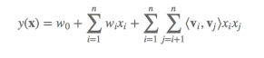

# 机器学习笔记

> 前言：本筆記主要用於記錄一些秋招時的機器學習復習筆記。
> 

# 0.ML&DL通用知识

##  SGD,Momentum,Adagard,Adam原理

> - SGD为随机梯度下降,每一次迭代计算数据集的mini-batch的梯度,然后对参数进行跟新。
> - Momentum参考了物理中动量的概念,前几次的梯度也会参与到当前的计算中,但是前几轮的梯度叠加在当前计算中会有一定的衰减。
> - Adagard在训练的过程中可以自动变更学习的速率,设置一个全局的学习率,而实际的学习率与以往的参数模和的开方成反比。
> - Adam利用梯度的一阶矩估计和二阶矩估计动态调整每个参数的学习率,在经过偏置的校正后,每一次迭代后的学习率都有个确定的范围,使得参数较为平稳。

##  SIFT特征提取和匹配的具体步骤

> 生成高斯差分金字塔；尺度空间构建，空间极值点检测；稳定关键点的精确定位稳，定关键点方向信息分配；关键点描述，特征点匹配。

## 机器学习中的距离计算？

- 欧式距离

- 曼哈顿距离

- 余弦距离

- 切比雪夫距离

  $d_{cheb}=max(x_1-x_2,y_1-y_2)$

- 汉明距离

## 生成模型和判别模型基本形式，有哪些？

> **生成式：**朴素贝叶斯、HMM、Gaussians、马尔科夫随机场，生成对抗网络GAN，变分自编码器
>
> **判别式：**LR，SVM，神经网络，CRF，Boosting
>
> 自编码器：收缩自编码器和正则自编码器为判别模型，变分自编码器为生成模型

## 如果数据有问题，怎么处理？

> - 上下采样平衡正负样例比；
> - 考虑缺失值；
> - 数据归一化 

## L1和L2正则化的区别？

- L1是模型**各个参数的绝对值之和**,L2为**各个参数平方和的开方值**。

- L1更趋向于产生少量的特征,其它特征为0,最优的参数值很大概率出现在坐标轴上,从而导致产生稀疏的权重矩阵；L2会选择更多的矩阵,但是这些矩阵趋向于0。 

## LOSS Function有哪些？怎麽用？

| 損失函數             | 用途          |
| -------------------- | ------------- |
| 平方損失             | 預測問題      |
| 交叉熵               | 分類問題      |
| hinge損失            | SVM支持向量機 |
| CART回歸樹的殘差損失 |               |

## 池化层的作用是什么？

## Batch Normalization的作用是什么？

> 机器学习领域有个重要假设， **IID独立同分布假设**，就是假设训练数据和测试数据是满足相同分布的，这是通过训练数据获得的模型能够在测试集获得好的效果的一个基本保障。 
>
> **Batch  Normalization 就是在深度神经网络训练过程中使得每一层神经网络的输入保持相同分布的。也就是** 

###  **covariate shift** 

对于深度学习这种包含很多隐层的网络结构，在训练过程中，因为各层参数不停在变化，所以每个隐层都会面临covariate shift的问题，也就是**在训练过程中，隐层的输入分布老是变来变去，这就是所谓的“Internal Covariate Shift”，Internal指的是深层网络的隐层，是发生在网络内部的事情，而不是covariate shift问题只发生在输入层。** 

---

**问题：**BN的本质思想在于深度神经网络在做线性变换前的激活输入值随着网络深度加深或者训练过程中，其分布逐渐发生变化，导致整体分布逐渐往非线性函数的取值区间的上下限两端靠近。 对于Sigmoid函数来说，意味着激活输入值WU+B是大的负值或正值），所以这**导致反向传播时低层神经网络的梯度消失**，这是训练深层神经网络收敛越来越慢的**本质原因** 。

**BN的作用在于采用一定的规范化手段，把每层神经网络任意神经元输入值的分布强行规范化为均值为0，方差为1的标准正态分布。**

这样会使得激活输入值落在非线性函数对输入较为敏感的区域，从而输入的小变化就会导致损失函数产生较大的变化，即使得梯度变大，避免梯度小时的问题，同时梯度变大意味着学习收敛速度快，能够大大加快训练速度。

---

**BN的总结：**对于每个隐层神经元，把逐渐向非线性函数映射后向取值区间极限饱和靠拢的输入分布强制拉回到均值为0、方差为1的标准正态分布， 使得非线性变换函数的输入值落入对输入比较敏感的区域，以此避免梯度消失问题。

同时，BN为了保证非线性的获得，对变换后的满足均值为0、方差为1的输入又进行了scale加上shift的操作，即线性变化$y = scale*x+shift$

每层神经元增加了scale和shift两个参数，这两个参数通过训练学习得到。这等价于将非线性函数的值从正中心周围的线性区域往非线性区移动，即找到一个线性和非线性的较好平衡点，既能享受非线性较强表达能力的好处，又能避免太靠近非线性区域两端使得网络收敛速度较慢的缺点。

BN的变化即对于每一个值减去均值并且除以标准差。

---

 **Batch Normalization的好处**

- 不仅仅极大提升了训练速度，收敛过程大大加快；

- 还能增加分类效果，一种解释是这是类似于Dropout的一种防止过拟合的正则化表达方式，所以不用Dropout也能达到相当的效果；

- 另外调参过程也简单多了，对于初始化要求没那么高，而且可以使用大的学习率等。

## 卷积神经网络CNN为什么能够用于提取特征？

## 如何防止过拟合？

1. 早停法early stopping；

2. l1和l2正则化；
3. 神经网络的dropout；
4. 决策树剪枝；
5. SVM的松弛变量；
6. 集成学习 

## 如何解决训练样本不平衡问题？

K折交叉验证，

# 1.傳統的機器學習模型

- 回歸算法

  最小二乘法，逐步式回归，多元自适应回归样条

- 基於實例方法

- 决策树学习

- 贝叶斯方法

- 基于核的方法

- 聚类算法

- 降维算法

- 关联规则学习

- 集成学习

- 人工神经网络

  

## 1.1 逻辑斯蒂回归（对率回归）LR

> 逻辑回归本质上是线性回归，只是在特征到结果的映射中加入了一层逻辑函数g(z)，即先把特征线性求和，然后使用函数g(z)作为假设函数来预测。g(z)可以将连续值映射到0 和1。g(z)为sigmoid function.

公式如下：

$$h_{\theta}={1 \over 1+e^{-\theta^{T}x}}$$

sigmoid函数求导后可得：

$g^{'}(z)=g(z)(1-g(z))$

---

### 逻辑回归怎么实现多分类

> - 方式一:修改逻辑回归的损失函数,使用softmax函数构造模型解决多分类问题,softmax分类模型会有相同于类别数的输出,输出的值为对于样本属于各个类别的概率,最后对于样本进行预测的类型为概率值最高的那个类别。
>
> - 方式二:根据每个类别都建立一个二分类器,本类别的样本标签定义为0,其它分类样本标签定义为1,则有多少个类别就构造多少个逻辑回归分类器

若所有类别之间有明显的互斥则使用softmax分类器,若所有类别不互斥有交叉的情况则构造相应类别个数的逻辑回归分类器。

### 交叉熵公式

交叉熵：设p(x)、q(x)是X中取值的两个概率分布，则p对q的相对熵是：

$$D(p||q)=\Sigma_{(x)}{p(x)log(p(x)) \over {q(x)} }=E_{p(x)}{log{p(x) \over q(x)}}$$

在一定程度上，相对熵可以度量两个随机变量的“距离”，且有D(p||q) ≠D(q||p)。另外，值得一提的是，D(p||q)是必然大于等于0的。

**互信息：**两个随机变量X，Y的互信息定义为X，Y的联合分布和各自独立分布乘积的相对熵，用I(X,Y)表示：

## 1.2 SVM

### 1.2.1 什么是支持向量机,SVM与LR的区别?

> 支持向量机为一个二分类模型,它的基本模型定义为特征空间上的间隔最大的线性分类器，而它的学习策略为最大化分类间隔,最终可转化为凸二次规划问题求解。
>
> LR是参数模型,SVM为非参数模型。LR采用的损失函数为logistical loss,而SVM采用的是hinge loss。
>
> 在学习分类器的时候,SVM只考虑与分类最相关的少数支持向量点。LR的模型相对简单,在进行大规模线性分类时比较方便。
>
> **区别：**线性回归用来做预测,LR用来做分类。线性回归是来拟合函数,LR是来预测函数。线性回归用最小二乘法来计算参数,LR用最大似然估计来计算参数。线性回归更容易受到异常值的影响,而LR对异常值有较好的稳定性。 

### 1.2.2 SVM中什么时候用线性核什么时候用高斯核?

> **当数据的特征提取的较好,所包含的信息量足够大**,很多问题是**线性可分**的那么可以采用==**线性核**==。
>
> **若特征数较少,样本数适中,对于时间不敏感**,遇到的问题是**线性不可分**的时候可以使用==**高斯核**==来达到更好的效果。 

## 1.3 决策树

### ID3,C4.5和CART三种决策树的区别

> ID3决策树优先选择信息增益大的属性来对样本进行划分,但是这样的分裂节点方法有一个很大的缺点,当一个属性可取值数目较多时,可能在这个属性对应值下的样本只有一个或者很少个,此时它的信息增益将很高,ID3会认为这个属性很适合划分,但实际情况下叫多属性的取值会使模型的泛化能力较差,所以C4.5不采用信息增益作为划分依据,而是采用信息增益率作为划分依据。但是仍不能完全解决以上问题,而是有所改善,这个时候引入了CART树,它使用gini系数作为节点的分裂依据。 

**总而言之：**三者对样本进行划分的依据不同，如下表：

| 决策树 | 划分方式           |
| ------ | ------------------ |
| ID3    | 信息增益           |
| C4.5   | 信息增益率         |
| CART   | Gini系数，基尼系数 |

## 1.4 聚类算法

### 1.4.1 什么是DBSCAN？

> DBSCAN（Density-Based Spatial Clustering of Applications with Noise）聚类算法，它是一种基于高密度连通区域的、基于密度的聚类算法，能够将具有足够高密度的区域划分为簇，并在具有噪声的数据中发现任意形状的簇。我们总结一下DBSCAN聚类算法原理的基本要点：
>
> DBSCAN算法需要选择一种距离度量，对于待聚类的数据集中，任意两个点之间的距离，反映了点之间的密度，说明了点与点是否能够聚到同一类中。由于DBSCAN算法对高维数据定义密度很困难，所以对于二维空间中的点，可以使用欧几里德距离来进行度量。
>
> DBSCAN算法需要用户输入2个参数：**一个参数是半径（Eps），表示以给定点P为中心的圆形邻域的范围，另一个参数是以点P为中心的邻域内最少点的数量MinPts**。如果满足：以点P为中心、半径为Eps的邻域内的点的个数不少于MinPts，则称点P为核心点。
>
> DBSCAN聚类使用到一个k-距离的概念，k-距离是指：给定数据集P={p(i); i=0,1,…n}，对于任意点P(i)，计算点P(i)到集合D的子集S={p(1), p(2), …, p(i-1), p(i+1), …, p(n)}中所有点之间的距离，距离按照从小到大的顺序排序，假设排序后的距离集合为D={d(1), d(2), …, d(k-1), d(k), d(k+1), …,d(n)}，则d(k)就被称为k-距离。也就是说，k-距离是点p(i)到所有点（除了p(i)点）之间距离第k近的距离。对待聚类集合中每个点p(i)都计算k-距离，最后得到所有点的k-距离集合E={e(1), e(2), …, e(n)}。 

### 1.4.2 K-Means算法

> K-Means算法流程：
>
> 1）从数据集中随机选择k个聚类样本作为初始的聚类中心,
>
> 2）然后计算数据集中每个样本到这k个聚类中心的距离,并将此样本分到距离最小的聚类中心所对应的类中。
>
> 3）将所有样本归类后,对于每个类别重新计算每个类别的聚类中心即每个类中所有样本的质心
>
> 4）重复以上操作直到聚类中心不变为止。 

 k-means的缺点： 

1）k-means是**局部最优**的，容易受到初始质心的影响；比如在下图中，因选择初始质心不恰当而造成次优的聚类结果。

2）同时，**k值的选取也会直接影响聚类结果**，最优聚类的k值应与样本数据本身的结构信息相吻合，而这种结构信息是很难去掌握，因此选取最优k值是非常困难的。

### 1.4.3 线性判别分析LDA的原理？

LDA是一种基于有监督学习的降维方式,将数据集在低维度的空间进行投影,**要使得投影后的==同类别的数据点间的距离尽可能的靠近,而不同类别间的数据点的距离尽可能的远。==** 

## 1.5 集成学习

> [参考链接](https://www.nowcoder.com/tutorial/95/1febc9ddb91f46098f7341b05831db69)

### 1.5.1 bagging和boosting的区别

Bagging是从训练集中进行子抽样组成每个基模型所需要的子训练集,然后对所有基模型预测的结果进行综合操作产生最终的预测结果。

Boosting中基模型按次序进行训练,而基模型的训练集按照某种策略每次都进行一定的转化,最后以一定的方式将基分类器组合成一个强分类器。

Bagging的训练集是在原始集中有放回的选取,而Boosting每轮的训练集不变,只是训练集中的每个样本在分类器中的权重都会发生变化,此权值会根据上一轮的结果进行调整。

Bagging的各个预测函数可以并行生成,Boosting的各预测函数只能顺序生成。

Bagging中整体模型的期望近似于基模型的期望,所以整体模型的偏差相似于基模型的偏差,因此Bagging中的基模型为强模型(强模型拥有低偏差高方差)。

Boosting中的基模型为弱模型,若不是弱模型会导致整体模型的方差很大。

### 1.5.2 boosting和 bagging区别

1）样本选择上：Bagging：训练集是在原始集中有放回选取的，从原始集中选出的各轮训练集之间是独立的。Boosting：每一轮的训练集不变，只是训练集中每个样例在分类器中的权重发生变化。而权值是根据上一轮的分类结果进行调整。

2）样例权重：Bagging：使用均匀取样，每个样例的权重相等。Boosting：根据错误率不断调整样例的权值，错误率越大则权重越大。

3）预测函数：Bagging：所有预测函数的权重相等。Boosting：每个弱分类器都有相应的权重，对于分类误差小的分类器会有更大的权重。

4）并行计算：Bagging：各个预测函数可以并行生成。Boosting：各个预测函数只能顺序生成，因为后一个模型参数需要前一轮模型的结果。

## 朴素贝叶斯（naive Bayes）法的要求是？

> 贝叶斯定理、特征条件独立假设
>
> 解析：朴素贝叶斯属于生成式模型，学习输入和输出的联合概率分布。给定输入x，利用贝叶斯概率定理求出最大的后验概率作为输出y。

## 讲一下PCA

1) PCA是比较常见的**线性降维**方法,通过**线性投影将高维数据映射到低维数据中**,所期望的是在投影的维度上,**新特征自身的方差尽量大,方差越大特征越有效,尽量使产生的新特征间的相关性越小。**

2) PCA算法的具体操作:

为对所有的样本进行中心化操作,计算样本的协方差矩阵,然后对协方差矩阵做特征值分解,取最大的n个特征值对应的特征向量构造投影矩阵。

## 分类算法列一下有多少种？应用场景。

单一的分类方法主要包括：

- LR逻辑回归

- SVM支持向量机

- DT决策树

- NB朴素贝叶斯

- NN人工神经网络

- K-近邻

**集成学习算法：**

  - 基于Bagging和Boosting算法思想
  - RF随机森林
  - GBDT
  - Adaboost
  - XGboost

---

---

---

# 2.推荐算法

> - 基于人口学的推荐
> - 基于内容的推荐
> - 基于用户的协同过滤推荐
> - 基于项目的协同过滤推荐
> - 基于模型的协同过滤推荐
> - 基于关联规则的推荐 

FM:

  

## 2.1 协同过滤的itemCF，userCF区别适用场景

Item CF 和 User CF两个方法都能很好的给出推荐，并可以达到不错的效果。但是他们之间还是有不同之处的，而且适用性也有区别。下面进行一下对比

计算复杂度：

Item CF 和 User CF 是基于协同过滤推荐的两个最基本的算法，User CF 是很早以前就提出来了，Item CF 是从 Amazon 的论文和专利发表之后（2001 年左右）开始流行，大家都觉得 Item CF 从性能和复杂度上比 User CF 更优，其中的一个主要原因就是对于一个在线网站，用户的数量往往大大超过物品的数量，同时物品的数据相对稳定，因此计算物品的相似度不但计算量较小，同时也不必频繁更新。但我们往往忽略了这种情况只适应于提供商品的电子商务网站，对于新闻，博客或者微内容的推荐系统，情况往往是相反的，物品的数量是海量的，同时也是更新频繁的，所以单从复杂度的角度，这两个算法在不同的系统中各有优势，推荐引擎的设计者需要根据自己应用的特点选择更加合适的算法。

适用场景：

在非社交网络的网站中，内容内在的联系是很重要的推荐原则，它比基于相似用户的推荐原则更加有效。比如在购书网站上，当你看一本书的时候，推荐引擎会给你推荐相关的书籍，这个推荐的重要性远远超过了网站首页对该用户的综合推荐。可以看到，在这种情况下，Item CF 的推荐成为了引导用户浏览的重要手段。同时 Item CF 便于为推荐做出解释，在一个非社交网络的网站中，给某个用户推荐一本书，同时给出的解释是某某和你有相似兴趣的人也看了这本书，这很难让用户信服，因为用户可能根本不认识那个人；但如果解释说是因为这本书和你以前看的某本书相似，用户可能就觉得合理而采纳了此推荐。

相反的，在现今很流行的社交网络站点中，User CF 是一个更不错的选择，User CF 加上社会网络信息，可以增加用户对推荐解释的信服程度。

## 2.2 推荐系统的大概步骤，如何解决冷启动？

步骤：1）收集用户的所有信息。2）使用大数据计算平台对收集的信息进行处理，的到用户偏好数据。3）将偏好数据导入喜好类型计算算法中进行预算计算，的到预算结果。4）将推荐的结果导入数据库（redis、hbase）。5）发开一个推荐引擎，对外开放接口，输出推荐结果。

解决冷启动的方案：

1）提供非个性化的推荐

最简单的例子就是提供热门排行榜，可以给用户推荐热门排行榜，等到用户数据收集到一定的时候，再切换为个性化推荐。例如Netflix的研究也表明新用户在冷启动阶段确实是更倾向于热门排行榜的，老用户会更加需要长尾推荐

2）利用用户注册信息

用户的注册信息主要分为3种：（1）获取用户的注册信息；（2）根据用户的注册信息对用户分类；（3）给用户推荐他所属分类中用户喜欢的物品。

3）选择合适的物品启动用户的兴趣

用户在登录时对一些物品进行反馈，收集用户对这些物品的兴趣信息，然后给用户推荐那些和这些物品相似的物品。一般来说，能够用来启动用户兴趣的物品需要具有以下特点：

比较热门，如果要让用户对物品进行反馈，前提是用户得知道这是什么东西；

具有代表性和区分性，启动用户兴趣的物品不能是大众化或老少咸宜的，因为这样的物品对用户的兴趣没有区分性；

启动物品集合需要有多样性，在冷启动时，我们不知道用户的兴趣，而用户兴趣的可能性非常多，为了匹配多样的兴趣，我们需要提供具有很高覆盖率的启动物品集合，这些物品能覆盖几乎所有主流的用户兴趣

4）利用物品的内容信息

用来解决物品的冷启动问题，即如何将新加入的物品推荐给对它感兴趣的用户。物品冷启动问题在新闻网站等时效性很强的网站中非常重要，因为这些网站时时刻刻都有新物品加入，而且每个物品必须能够再第一时间展现给用户，否则经过一段时间后，物品的价值就大大降低了。

5）采用专家标注

很多系统在建立的时候，既没有用户的行为数据，也没有充足的物品内容信息来计算物品相似度。这种情况下，很多系统都利用专家进行标注。

6）利用用户在其他地方已经沉淀的数据进行冷启动

以QQ音乐举例：QQ音乐的猜你喜欢电台想要去猜测第一次使用QQ音乐的用户的口味偏好，一大优势是可以利用其它腾讯平台的数据，比如在QQ空间关注了谁，在腾讯微博关注了谁，更进一步，比如在腾讯视频刚刚看了一部动漫，那么如果QQ音乐推荐了这部动漫里的歌曲，用户会觉得很人性化。这就是利用用户在其它平台已有的数据。

再比如今日头条：它是在用户通过新浪微博等社交网站登录之后，获取用户的关注列表，并且爬取用户最近参与互动的feed（转发/评论等），对其进行语义分析，从而获取用户的偏好。

所以这种方法的前提是，引导用户通过社交网络账号登录，这样一方面可以降低注册成本提高转化率；另一方面可以获取用户的社交网络信息，解决冷启动问题。

7）利用用户的手机等兴趣偏好进行冷启动

Android手机开放的比较高，所以在安装自己的app时，就可以顺路了解下手机上还安装了什么其他的app。比如一个用户安装了美丽说、蘑菇街、辣妈帮、大姨妈等应用，就可以判定这是女性了，更进一步还可以判定是备孕还是少女。目前读取用户安装的应用这部分功能除了app应用商店之外，一些新闻类、视频类的应用也在做，对于解决冷启动问题有很好的帮助。