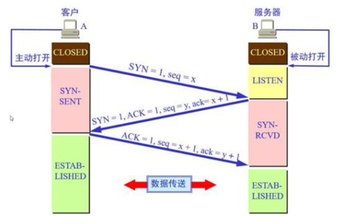
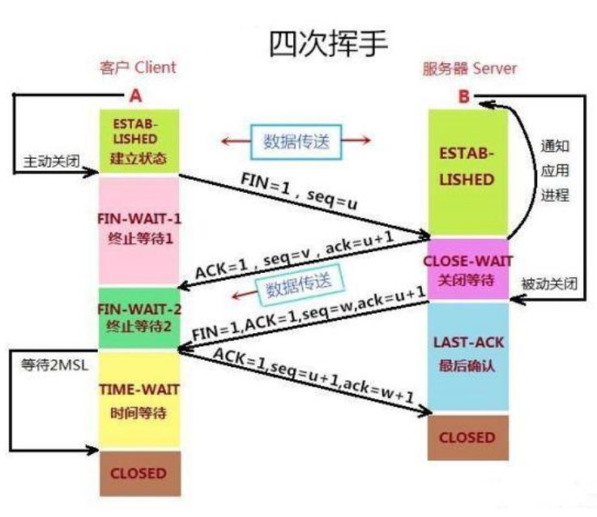

# 计算机网络学习笔记

[网络层和协议]()

[三次握手和四次挥手]()

> TCP建立连接时之所以只需要"三次握手"，是因为在第二次"握手"过程中，服务器端发送给客户端的TCP报文是以SYN与ACK作为标志位的。SYN是请求连接标志，表示服务器端同意建立连接；ACK是确认报文，表示告诉客户端，服务器端收到了它的请求报文。 
>
> 即SYN建立连接报文与ACK确认接收报文是在同一次"握手"当中传输的，所以"三次握手"不多也不少，正好让双方明确彼此信息互通。 
>
> 三次握手的原因: 三次握手的目的是“为了防止已经失效的连接请求报文段突然又传到服务端，因而产生错误” 

参考： https://www.cnblogs.com/jainszhang/p/10641728.html 

[IP地址]()

