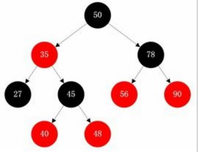
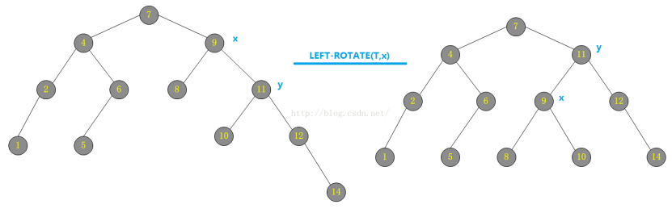
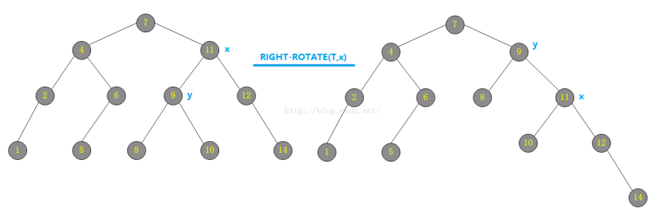

# 数据结构常考面试题

## 请问红黑树了解吗

参考回答：

参考博客https://blog.csdn.net/tanrui519521/article/details/80980135

## 说一说红黑树和AVL树的定义，特点以及二者区别

> 平衡二叉树（AVL树）： 

**平衡二叉树又称为AVL树，是一种特殊的二叉排序树。其左右子树都是平衡二叉树，且左右子树高度之差的绝对值不超过1。**

一句话表述为：以树中所有结点为根的树的左右子树高度之差的绝对值不超过1。

将二叉树上结点的左子树深度减去右子树深度的值称为平衡因子BF，那么平衡二叉树上的所有结点的平衡因子只可能是-1、0和1。只要二叉树上有一个结点的平衡因子的绝对值大于1，则该二叉树就是不平衡的。 

>  红黑树（RBTree）： 

 **红黑树是一种二叉查找树，但在每个节点增加一个存储位表示节点的颜色，可以是红或黑（非红即黑）。**

通过对任何一条从根到叶子的路径上各个节点着色的方式的限制，红黑树确保没有一条路径会比其它路径长出两倍。

因此，红黑树是一种弱平衡二叉树，相对于要求严格的AVL树来说，它的旋转次数少，所以对于搜索，插入，删除操作较多的情况下，通常使用红黑树。 

**红黑树的性质：**

1. 每个节点非红即黑

2. 根节点是黑的;

3. 每个叶节点（叶节点即树尾端NULL指针或NULL节点）都是黑的;

4. 如果一个节点是红色的，则它的子节点必须是黑色的。

5. 对于任意节点而言，其到叶子节点NULL指针的每条路径都包含相同数目的黑节点;

> 从根到叶子的最长的可能路径不多于最短的可能路径的两倍长。它可以在O(log n)时间内做查找，插入和删除，这里的n 是树中元素的数目。恢复红黑属性需要少量(O(log n))的颜色变更(这在实践中是非常快速的)并且不超过三次树旋转(对于插入是两次)。这允许插入和删除保持为 O(log n) 次.

**红黑树旋转：**

旋转：红黑树的旋转是一种能保持二叉搜索树性质的搜索树局部操作。有左旋和右旋两种旋转，通过改变树中某些结点的颜色以及指针结构来保持对红黑树进行插入和删除操作后的红黑性质。

左旋：对某个结点x做左旋操作时，假设其右孩子为y而不是T.nil：以x到y的链为“支轴”进行。使y成为该子树新的根结点，x成为y的左孩子，y的左孩子成为x的右孩子。

右旋：对某个结点x做右旋操作时，假设其左孩子为y而不是T.nil：以x到y的链为“支轴”进行。使y成为该子树新的根结点，x成为y的右孩子，y的右孩子成为x的左孩子。

> 两者的区别

AVL 树是高度平衡的，频繁的插入和删除，会引起频繁的再平衡，导致效率下降。

红黑树不是高度平衡的，算是一种折中，插入最多两次旋转，删除最多三次旋转。 

所以红黑树在查找，插入删除的性能都是O(logn)，且性能稳定，所以STL里面很多结构包括map底层实现都是使用的红黑树。

## 请你说一下哈夫曼编码

参考回答：

哈夫曼编码是哈夫曼树的一种应用，广泛用于数据文件压缩。

哈夫曼编码算法用字符在文件中出现的频率来建立使用0，1表示个字符的最优表示方式，其具体算法如下：

(1)哈夫曼算法==以自底向上的方式==构造表示最优前缀码的二叉树T。

(2)算法以|C|个叶结点开始，执行|C|－1次的“合并”运算后产生最终所要求的树T。

(3)假设编码字符集中每一字符c的频率是f(c)。以f为键值的优先队列Q用在贪心选择时有效地确定算法当前要合并的2棵具有最小频率的树。一旦2棵具有最小频率的树合并后，产生一棵新的树，其频率为合并的2棵树的频率之和，并将新树插入优先队列Q。经过n－1次的合并后，优先队列中只剩下一棵树，即所要求的树T。

## 请你介绍一下B+树

参考回答：

B+是一种多路搜索树，主要为磁盘或其他直接存取辅助设备而设计的一种平衡查找树，在B+树中，每个节点的可以有多个孩子，并且按照关键字大小有序排列。所有记录节点都是按照键值的大小顺序存放在同一层的叶节点中。相比B树，其具有以下几个特点：

每个节点上的指针上限为2d而不是2d+1（d为节点的出度）

内节点不存储data,只存储key

叶子节点不存储指针

## 请你说一说map和unordered_map的底层实现

参考回答：

map底层是基于红黑树实现的，因此map内部元素排列是有序的。

而unordered_map底层则是基于哈希表实现的，因此其元素的排列顺序是杂乱无序的。

## 请你回答一下map和unordered_map优点和缺点

参考回答：

对于map，其底层是基于红黑树实现的，优点如下：

1)有序性，这是map结构最大的优点，其元素的有序性在很多应用中都会简化很多的操作

2)map的查找、删除、增加等一系列操作时间复杂度稳定，都为logn

缺点如下：

1）查找、删除、增加等操作平均时间复杂度较慢，与n相关

对于unordered_map来说，其底层是一个哈希表，优点如下：

查找、删除、添加的速度快，时间复杂度为常数级O(c)

缺点如下：

因为unordered_map内部基于哈希表，以（key,value）对的形式存储，因此空间占用率高

Unordered_map的查找、删除、添加的时间复杂度不稳定，平均为O(c)，取决于哈希函数。极端情况下可能为O(n)

## 请你回答一下epoll怎么实现的

参考回答：

Linux epoll机制是通过红黑树和双向链表实现的。 首先通过epoll_create()系统调用在内核中创建一个eventpoll类型的句柄，其中包括红黑树根节点和双向链表头节点。然后通过epoll_ctl()系统调用，向epoll对象的红黑树结构中添加、删除、修改感兴趣的事件，返回0标识成功，返回-1表示失败。最后通过epoll_wait()系统调用判断双向链表是否为空，如果为空则阻塞。当文件描述符状态改变，fd上的回调函数被调用，该函数将fd加入到双向链表中，此时epoll_wait函数被唤醒，返回就绪好的事件。

## 请你说一说Top(K)问题

参考回答：

1、直接全部排序（只适用于内存够的情况）

当数据量较小的情况下，内存中可以容纳所有数据。则最简单也是最容易想到的方法是将数据全部排序，然后取排序后的数据中的前K个。

这种方法对数据量比较敏感，当数据量较大的情况下，内存不能完全容纳全部数据，这种方法便不适应了。即使内存能够满足要求，该方法将全部数据都排序了，而题目只要求找出top K个数据，所以该方法并不十分高效，不建议使用。

2、快速排序的变形 （只使用于内存够的情况）

这是一个基于快速排序的变形，因为第一种方法中说到将所有元素都排序并不十分高效，只需要找出前K个最大的就行。

这种方法类似于快速排序，首先选择一个划分元，将比这个划分元大的元素放到它的前面，比划分元小的元素放到它的后面，此时完成了一趟排序。

如果此时这个划分元的序号index刚好等于K，那么这个划分元以及它左边的数，刚好就是前K个最大的元素；

如果index  > K，那么前K大的数据在index的左边，那么就继续递归的从index-1个数中进行一趟排序；

如果index < K，那么再从划分元的右边继续进行排序，直到找到序号index刚好等于K为止。

再将前K个数进行排序后，返回Top K个元素。这种方法就避免了对除了Top K个元素以外的数据进行排序所带来的不必要的开销。

3、最小堆法

这是一种局部淘汰法。先读取前K个数，建立一个最小堆。然后将剩余的所有数字依次与最小堆的堆顶进行比较，如果小于或等于堆顶数据，则继续比较下一个；否则，删除堆顶元素，并将新数据插入堆中，重新调整最小堆。当遍历完全部数据后，最小堆中的数据即为最大的K个数。

4、分治法

将全部数据分成N份，前提是每份的数据都可以读到内存中进行处理，找到每份数据中最大的K个数。此时剩下N\*K个数据，如果内存不能容纳N\*K个数据，则再继续分治处理，分成M份，找出每份数据中最大的K个数，如果M*K个数仍然不能读到内存中，则继续分治处理。直到剩余的数可以读入内存中，那么可以对这些数使用快速排序的变形或者归并排序进行处理。

5、Hash法

如果这些数据中有很多重复的数据，可以先通过hash法，把重复的数去掉。这样如果重复率很高的话，会减少很大的内存用量，从而缩小运算空间。处理后的数据如果能够读入内存，则可以直接排序；否则可以使用分治法或者最小堆法来处理数据。

## 请你说一说C++两种map

参考回答：

unordered_map（哈希表)和map（红黑树）

